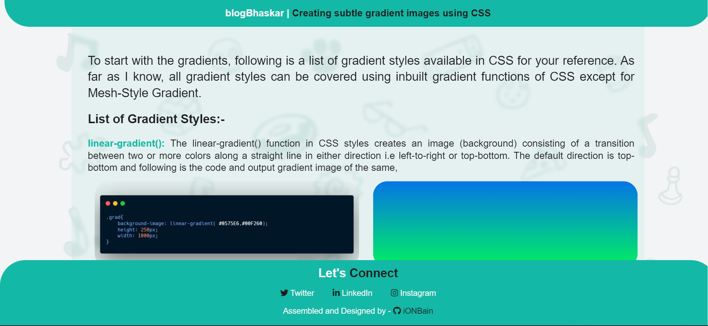

# blogOne-gradients
Stuck in deciding what background should you keep in your project? Check out my first blog which discusses how to add gradients using simple CSS.
> What's special - I have added background animation which triggers on mouseMove, do check it by [clicking here](https://blogone-ba.netlify.app/)

* The landing page of my blog is as follows

> Technologies/Libraries used :-
* Vanilla Javascript
* CSS
* HTML

> Platform used to develop project :-
* [Visual Studio Code](https://code.visualstudio.com/)
> Platform used to host and deploy the project :-
* [Github.com](https://github.com/ionbain)
* [Netlify.com](https://app.netlify.com/teams/bhaskartx/)
